# draw pentagram with python

## Tutorials:

### tutorial 01:

The simplest code to draw a pentagram

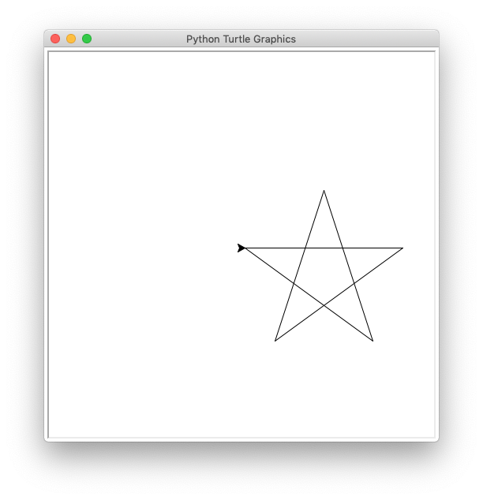

### tutorial 02:

Fill the pentagram with color

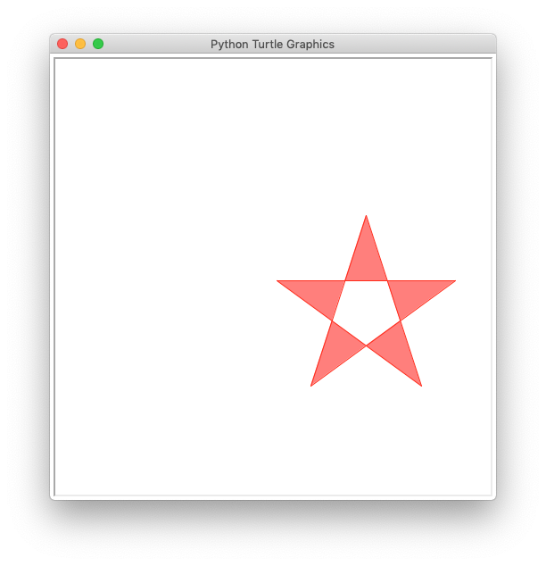

### tutorial 03:

We need a edge only pentagram.
So we can fill the whole pentagram with color.

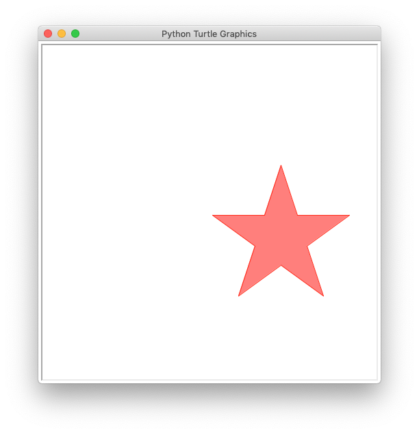

### tutorial 04:

Move the pentagram to center of the window. final center at (0,0).
It is easy to kown , how to move the pentagram to the center of horizontal.
Move the start point from (0, 0) to (-100, 0) is what we want.

But how about the vertical center?
You need some math knowledge to resolve this.

This is how I get the Y_OFF.

`$GOLDEN\_SECTION ={\frac {{\sqrt {5}-1}}{2}}$`

`$CENTER\_YOFF ={\frac {{2GOLDEN\_SECTION-1}}{2}} * tan(54*\pi/180) * size$`

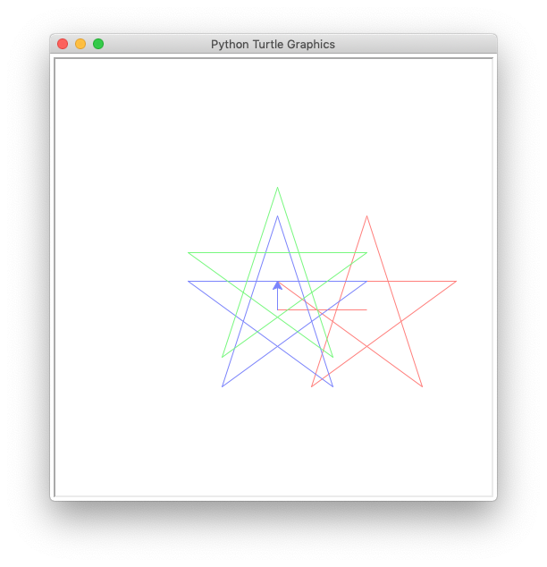

### tutorial 05:

Draw a lot of pentagram at once

style == diamond
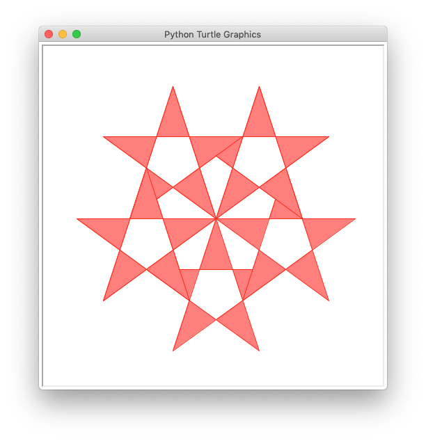

style == snail
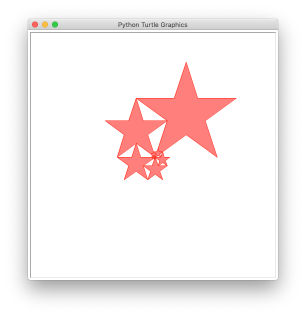

style == storm1
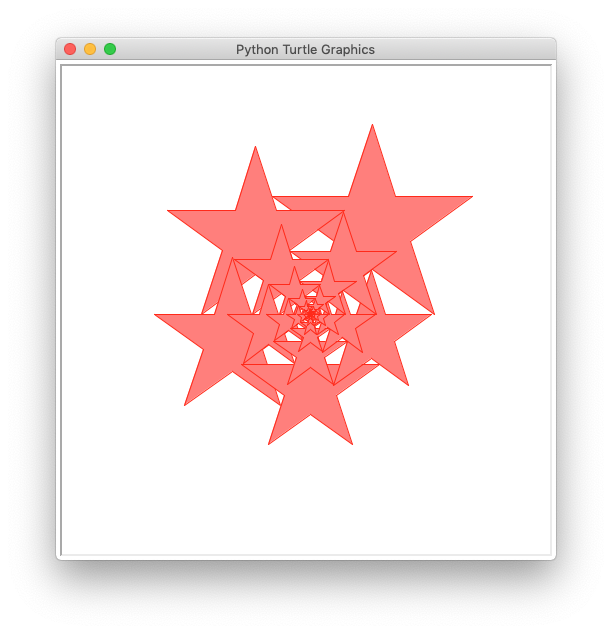

style == storm2
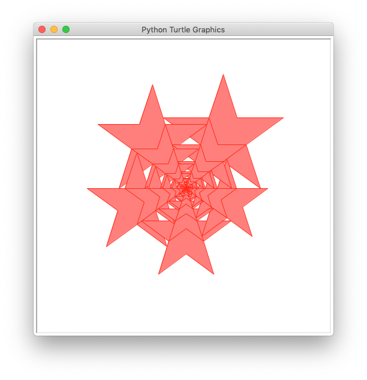


### tutorial 06:
Draw a lot of pentagram with different colors

style == diamond
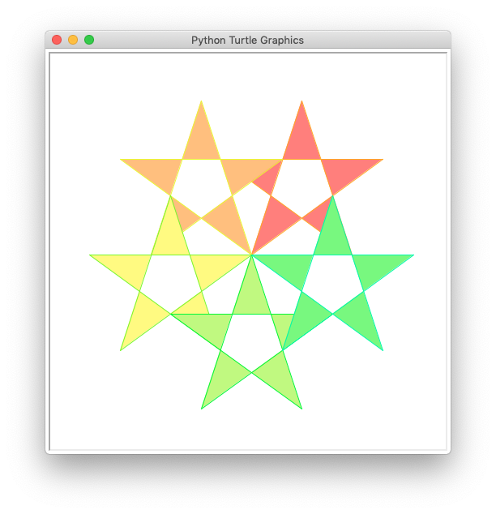

style == snail
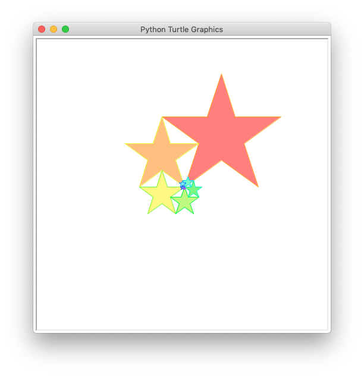

style == storm1
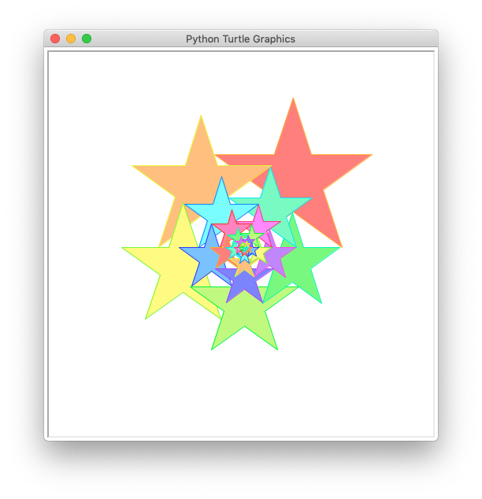

style == storm2


## Truble shutting:

If you get a error "No module named 'PIL'"
you need to install Pillow

```bash
pip install Pillow
```
