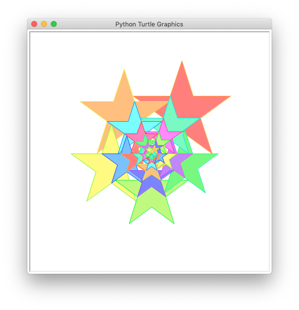

# draw pentagram with python

## Tutorials:

### tutorial 01:

The simplest code to draw a pentagram


### tutorial 02:

Fill the pentagram with color


### tutorial 03:

We need a edge only pentagram.
So we can fill the whole pentagram with color.


### tutorial 04:

Move the pentagram to center of the window. final center at (0,0).


### tutorial 05:

Draw a lot of pentagram at once


### tutorial 06:
Draw a lot of pentagram with different colors




## Truble shutting:
No module named 'PIL'

you need to install Pillow
```bash
pip install Pillow
```
